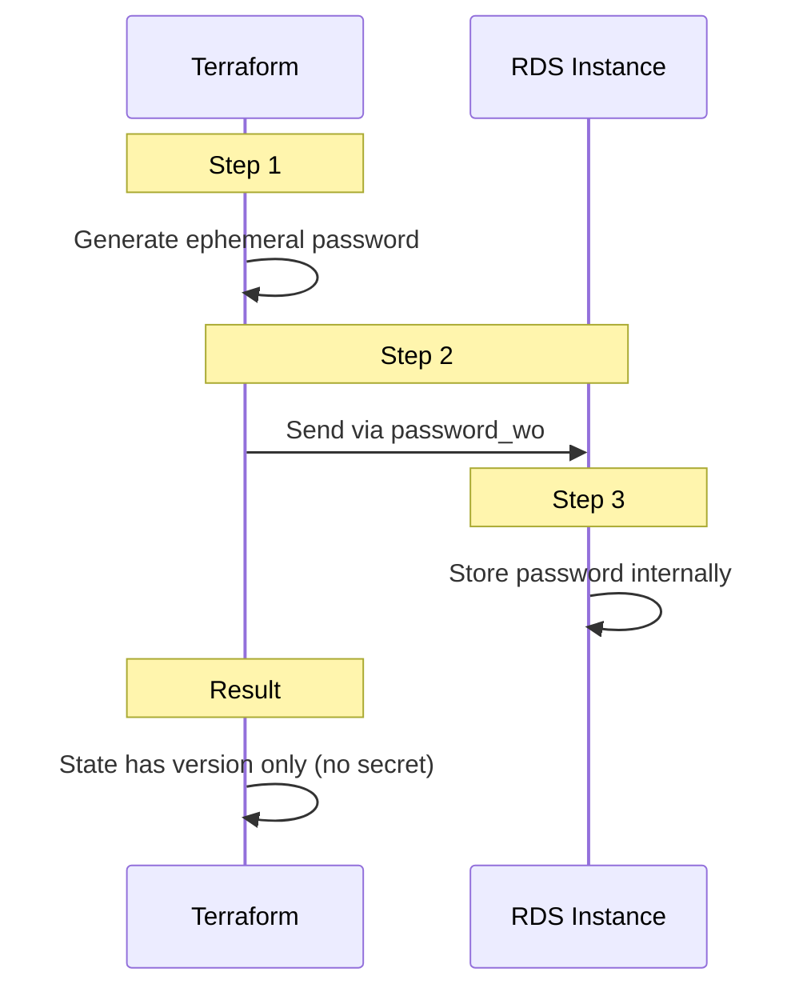
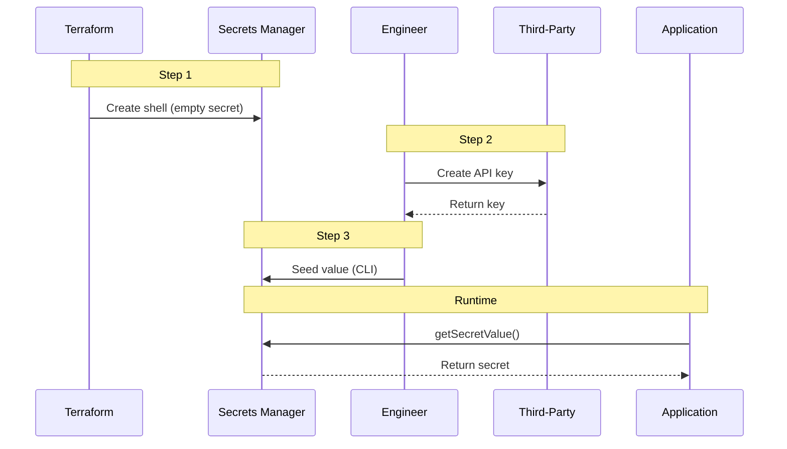
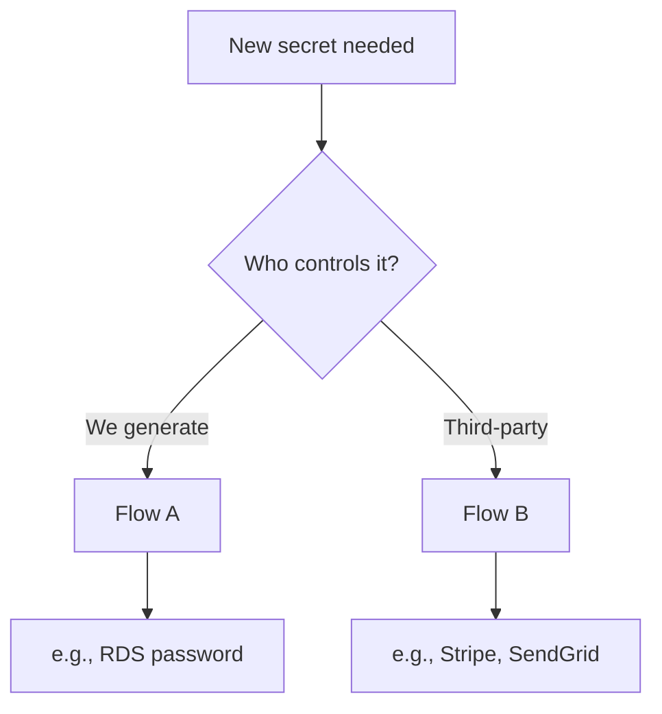

# AWS Secrets Manager - Engineering Secret Standard

Terraform POC for secure secret management with ephemeral values and write-only arguments.

## Flow A: TF-Generated Secrets



| Step | Action |
|------|--------|
| 1 | Terraform generates ephemeral password (never in state) |
| 2 | Password sent to RDS via `password_wo` |
| 3 | RDS stores password internally |

---

## Flow B: Third-Party Secrets



| Step | Who | Action |
|------|-----|--------|
| 1 | Terraform | Creates empty secret shell |
| 2 | Engineer | Creates key in third-party dashboard |
| 3 | Engineer | Seeds value via `node scripts/secrets.js seed` |
| 4 | Application | Reads secret at runtime via AWS SDK |

---

## Decision Flow



---

## Naming Convention

```
/{env}/{app}/{purpose}
```

| Secret | Name |
|--------|------|
| Stripe | `/dev/myapp/stripe-api-key` |
| SendGrid | `/dev/myapp/sendgrid-api-key` |
| OAuth | `/dev/myapp/oauth-credentials` |

---

## Quick Demo

```bash
# 1. Start LocalStack
docker-compose up -d

# 2. Install & Init
npm install
cd terraform-aws && terraform init

# 3. Create infrastructure (RDS + Secrets Manager shells)
terraform apply -var-file=terraform-localstack.tfvars

# 4. Seed third-party secrets (Flow B)
cd .. && node scripts/secrets.js seed

# 5. Verify
node scripts/secrets.js read

# 6. Cleanup
cd terraform-aws
terraform destroy -var-file=terraform-localstack.tfvars -auto-approve
cd .. && docker-compose down
```

---

## Configuration

| Variable | Flow | Description |
|----------|------|-------------|
| `rds_password_version` | A | Bump to rotate RDS password |

> **Flow B**: No Terraform variables needed. Apps read secrets at runtime via AWS SDK.

---

## CLI

```bash
node scripts/secrets.js seed    # Seed secrets
node scripts/secrets.js read    # Read secrets
node scripts/secrets.js list    # List names
```

---

## App Usage (Flow B)

```javascript
import { SecretsManagerClient, GetSecretValueCommand } from '@aws-sdk/client-secrets-manager';

const client = new SecretsManagerClient({ region: 'us-east-1' });
const response = await client.send(new GetSecretValueCommand({
  SecretId: '/dev/myapp/stripe-api-key'
}));
const { api_key } = JSON.parse(response.SecretString);
```

---

## References

- [Ephemeral Values](https://developer.hashicorp.com/terraform/language/values/ephemeral)
- [Write-Only Arguments](https://developer.hashicorp.com/terraform/language/resources/syntax#write-only-arguments)
- [AWS Secrets Manager Best Practices](https://docs.aws.amazon.com/secretsmanager/latest/userguide/best-practices.html)
